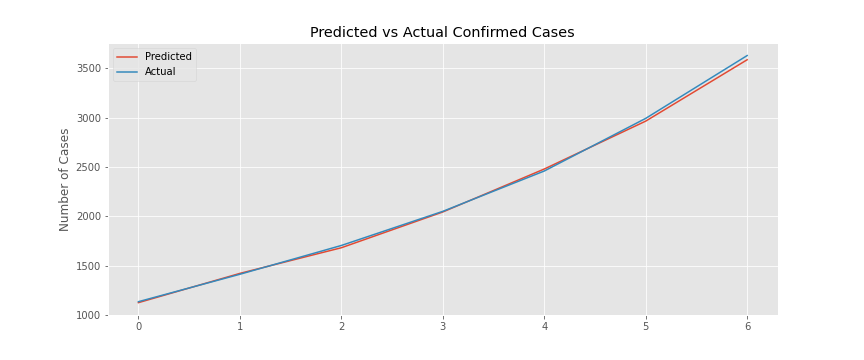
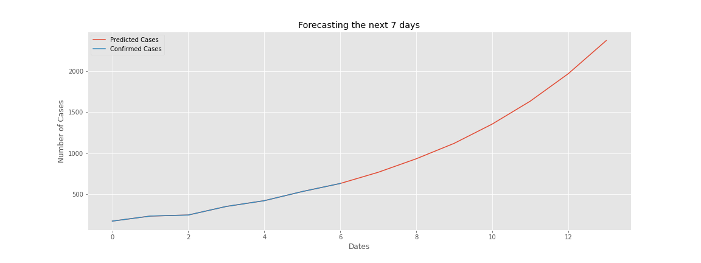

# COVID-19_Spread_Prediction
Neural network for predicting spread of COVID-19 virus in Poland

## Validations result

## Prediction result for 7 days

**Data:**

| Dates     |Number of confirmed cases|
|:---------:|:--:|
|2020-03-16 | 177|
|2020-03-17 | 238|
|2020-03-18 | 251|
|2020-03-19 | 355|
|2020-03-20 | 425|
|2020-03-21 | 536|
|2020-03-22 | 634|

**Predictions:**

| Dates     | Number of predicted cases|
|:---------:|:-----------:|
|2020-03-23 |  770.173645 |
|2020-03-24 |  934.040527 |
|2020-03-25 | 1121.861694 |
|2020-03-26 | 1355.681274 |
|2020-03-27 | 1633.808716 |
|2020-03-28 | 1966.820068 |
|2020-03-29 | 2369.612305 |
 

